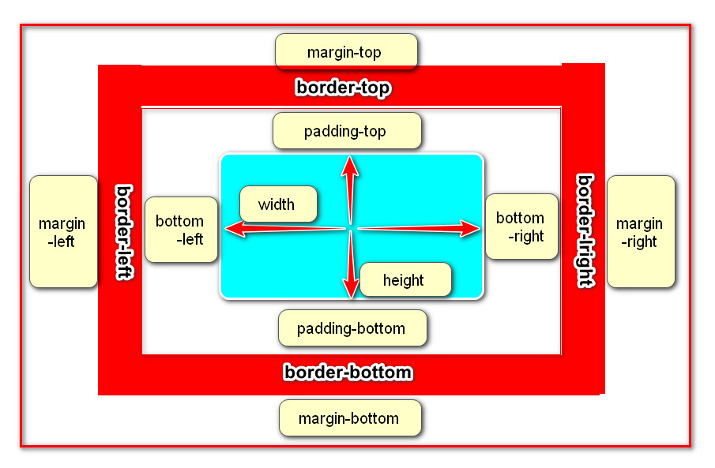

## HTML+CSS基础
### 1. HTML
> HTML 的全称为：HyperText Mark-up Language, 指的是超文本标记语言。 标记：就是标签, `<标签名称> </标签名称>`, 比如: `<html></html>`、`<h1></h1>` 等，标签大多数都是成对出现的。

- 因为网页中还可以图片、视频、音频等内容(超越文本限制)
- 它还可以在网页中跳转到另一个网页，与世界各地主机的网页链接(超链接文本)
#### 1.1 代码结构
```html
<!--是文档声明, 用来指定页面所使用的html的版本, 这里声明的是一个html5的文档。-->
<!DOCTYPE html> 
<!--标签是开发人员在告诉浏览器，整个网页是从<html>这里开始的，到<html>结束,也就是html文档的开始和结束标签。-->
<html>
<!--标签用于定义文档的头部,是负责对网页进行设置标题、编码格式以及引入css和js文件的。-->
    <head>            
        <meta charset="UTF-8">
        <title>网页标题</title>
    </head>
<!--标签是编写网页上显示的内容。-->
    <body>
          网页显示内容
    </body>
</html>
```

#### 1.2 常用标签
```html
<!-- 1、成对出现的标签：-->

<h1>h1标题</h1>
<div>这是一个div标签</div>
<p>这个一个段落标签</p>


<!-- 2、单个出现的标签： -->
<br>

<hr>

<!-- 3、带属性的标签，如src、alt 和 href等都是属性 -->

<a href="http://www.baidu.com">百度网</a>

<!-- 4、标签的嵌套 -->
<div>
    
    <a href="http://www.baidu.com">百度网</a>
</div>
```
1. 标签不区分大小写，但是推荐使用小写。
2. 根据标签的书写形式，标签分为双标签(闭合标签)和单标签(空标签)
    1. 双标签是指由开始标签和结束标签组成的一对标签，这种标签允许嵌套和承载内容，比如: div标签
    1. 单标签是一个标签组成，没有标签内容， 比如: img标签

#### 1.3 资源路径
```html

```
`* 一般使用相对路径`

#### 1.4 列表标签
- 无序列表标签(ul标签)
```html
<!-- ul标签定义无序列表 -->
<ul>
    <!-- li标签定义列表项目 -->
    <li>列表标题一</li>
    <li>列表标题二</li>
    <li>列表标题三</li>
</ul>
```
- 有序列表标签(ol标签)
```html
<!-- ol标签定义有序列表 -->
<ol>
    <!-- li标签定义列表项目 -->
    <li><a href="#">列表标题一</a></li>
    <li><a href="#">列表标题二</a></li>
    <li><a href="#">列表标题三</a></li>
</ol>
```

#### 1.5 表格标签
```html
<!--表示一个表格-->
<table>
    <!--表示表格中的一行-->
    <tr>
        <!--表示表格中的表头-->
        <th>姓名</th>
        <th>年龄</th>
    </tr>
    <tr>
        <!--表示表格中的列-->
        <td>张三</td>
        <td>18</td> 
    </tr>
</table>
```

#### 1.6 表单标签
##### `<form>`
> 表示表单标签，定义整体的表单区域
- action属性 设置表单数据提交地址
- method属性 设置表单提交的方式，一般有“GET”方式和“POST”方式, 不区分大小写

##### `<label>`
> 表示表单元素的文字标注标签，定义文字标注

##### `<input>`
> 表示表单元素的用户输入标签，定义不同类型的用户输入数据方式

**type属性**
- type="text" 定义单行文本输入框
- type="password" 定义密码输入框
- type="radio" 定义单选框
- type="checkbox" 定义复选框
- type="file" 定义上传文件
- type="submit" 定义提交按钮
- type="reset" 定义重置按钮
- type="button" 定义一个普通按钮

##### `<textarea>`
> 表示表单元素的多行文本输入框标签 定义多行文本输入框

##### `<select>`
>表示表单元素的下拉列表标签 定义下拉列表

##### `<option>`
> 与`<select>`标签配合，定义下拉列表中的选项

### 2. CSS
> css(Cascading Style Sheet)层叠样式表，它是用来美化页面的一种语言。

#### 2.1 作用
- 美化界面, 比如: 设置标签文字大小、颜色、字体加粗等样式。
- 控制页面布局, 比如: 设置浮动、定位等样式。

#### 2.2 CSS 基本语法
```text
选择器{
    样式规则
}
```
- 样式规则：
```text
属性名1：属性值1;
属性名2：属性值2;
属性名3：属性值3;
```
- 选择器:是用来选择标签的，选出来以后给标签加样式。
```css
div{ 
    width:100px; 
    height:100px; 
    background:gold; 
}
```

#### 2.3 CSS 的引入方式 
css的三种引入方式
1. 行内式
```html
<div style="width:100px; height:100px; background:red ">hello</div>
```
- 内嵌式（内部样式）
```html
<head>
   <style type="text/css">
      h3{
         color:red;
      }
   </style>
</head>
```
- 外链式
```html
<link rel="stylesheet" type="text/css" href="css/main.css">
```

#### 2.4 CSS 选择器
>css 选择器是用来选择标签的，选出来以后给标签加样式。
##### 2.4.1 CSS 选择器的种类
- 标签选择器
- 类选择器
- 层级选择器(后代选择器)
- id选择器
- 组选择器
- 伪类选择器
##### 2.4.2 CSS 标签选择器
> 根据标签来选择标签，以标签开头，此种选择器影响范围大，一般用来做一些通用设置。

示例代码
```html
<style type="text/css">
    p{
        color: red;
    }
</style>

<div>hello</div>
<p>hello</p>
```
##### 2.4.3 类选择器
> 根据类名来选择标签，以 . 开头, 一个类选择器可应用于多个标签上，一个标签上也可以使用多个类选择器，多个类选择器需要使用空格分割，应用灵活，可复用，是css中应用最多的一种选择器。

示例代码
```html
<style type="text/css">
    .blue{color:blue}
    .big{font-size:20px}
    .box{width:100px;height:100px;background:gold} 
</style>

<div class="blue">这是一个div</div>
<h3 class="blue big box">这是一个标题</h3>
<p class="blue box">这是一个段落</p>
```
##### 2.4.4 层级选择器(后代选择器)
> 根据层级关系选择后代标签，以选择器1 选择器2开头，主要应用在标签嵌套的结构中，减少命名。

示例代码
```html
<style type="text/css">
    div p{
        color: red;
    }
    .con{width:300px;height:80px;background:green}
    .con span{color:red}
    .con .pink{color:pink}
    .con .gold{color:gold}    
</style>

<div>
    <p>hello</p>
</div>

<div class="con">
    <span>哈哈</span>
    <a href="#" class="pink">百度</a>
    <a href="#" class="gold">谷歌</a>
</div>
<span>你好</span>
<a href="#" class="pink">新浪</a>
```
`* 这个层级关系不一定是父子关系，也有可能是祖孙关系，只要有后代关系都适用于这个层级选择器`

##### 2.4.5 id选择器
> 根据id选择标签，以#开头, 元素的id名称不能重复，所以id选择器只能对应于页面上一个元素，不能复用，id名一般给程序使用，所以不推荐使用id作为选择器。

示例代码
```html
<style type="text/css">
    #box{color:red} 
</style>

<p id="box">这是一个段落标签</p>   <!-- 对应以上一条样式，其它元素不允许应用此样式 -->
<p>这是第二个段落标签</p> <!-- 无法应用以上样式，每个标签只能有唯一的id名 -->
<p>这是第三个段落标签</p> <!-- 无法应用以上样式，每个标签只能有唯一的id名  -->
```

注意点: 虽然给其它标签设置id=“box”也可以设置样式，但是不推荐这样做，因为id是唯一的，以后js通过id只能获取一个唯一的标签对象。

##### 2.4.6 组选择器
> 根据组合的选择器选择不同的标签，以 , 分割开, 如果有公共的样式设置，可以使用组选择器。

示例代码
```html
<style type="text/css">
    .box1,.box2,.box3{width:100px;height:100px}
    .box1{background:red}
    .box2{background:pink}
    .box2{background:gold}
</style>

<div class="box1">这是第一个div</div>
<div class="box2">这是第二个div</div>
<div class="box3">这是第三个div</div>
```

##### 2.4.7 伪类选择器
> 用于向选择器添加特殊的效果, 以 : 分割开, 当用户和网站交互的时候改变显示效果可以使用伪类选择器

示例代码
```html
<style type="text/css">
    .box1{width:100px;height:100px;background:gold;}
    .box1:hover{width:300px;}
</style>

<div class="box1">这是第一个div</div>
```

#### 2.5 CSS 属性

##### 2.5.1 布局常用样式属性
- `width` 设置元素(标签)的宽度，如：`width:100px;`
- `height` 设置元素(标签)的高度，如：`height:200px;`
- `background` 设置元素背景色或者背景图片，如：`background:gold;` 设置元素的背景色, `background: url(images/logo.png);` 设置元素的背景图片。
- `border` 设置元素四周的边框，如：`border:1px solid black; `设置元素四周边框是1像素宽的黑色实线
    - `border-top` 设置顶边边框，如：`border-top:10px solid red;`
    - `border-left` 设置左边边框，如：`border-left:10px solid blue;`
    - `border-right` 设置右边边框，如：`border-right:10px solid green;`
    - `border-bottom` 设置底边边框，如：`border-bottom:10px solid pink;`
- `padding` 设置元素包含的内容和元素边框的距离，也叫内边距，如`padding:20px;padding`是同时设置4个边的，也可以像`border`一样拆分成分别设置四个边:`padding-top`、`padding-left`、`padding-right`、`padding-bottom`。
- `margin` 设置元素和外界的距离，也叫外边距，如`margin:20px;margin`是同时设置4个边的，也可以像`border`一样拆分成分别设置四个边:`margin-top`、`margin-left`、`margin-right`、`margin-bottom`。
- `float` 设置元素浮动，浮动可以让块元素排列在一行，浮动分为左浮动：`float:left;` 右浮动：`float:right;`

##### 2.5.2 文本常用样式属性
- `color` 设置文字的颜色，如： `color:red;`
- `font-size` 设置文字的大小，如：`font-size:12px;`
- `font-family` 设置文字的字体，如：`font-family:'微软雅黑';`为了避免中文字不兼容，一般写成：`font-family:'Microsoft Yahei';`
- `font-weight` 设置文字是否加粗，如：`font-weight:bold;` 设置加粗 `font-weight:normal `设置不加粗
- `line-height` 设置文字的行高，如：`line-height:24px;` 表示文字高度加上文字上下的间距是`24px`，也就是每一行占有的高度是`24px`
- `text-decoration` 设置文字的下划线，如：`text-decoration:none;` 将文字下划线去掉
- `text-align` 设置文字水平对齐方式，如`text-align:center` 设置文字水平居中
- `text-indent` 设置文字首行缩进，如：`text-indent:24px; `设置文字首行缩进`24px`

#### 2.6 元素溢出
> 当子元素(标签)的尺寸超过父元素(标签)的尺寸时，此时需要设置父元素显示溢出的子元素的方式，设置的方法是通过overflow属性来完成。

overflow的设置项：
- `visible` 默认值, 显示子标签溢出部分。
- `hidden` 隐藏子标签溢出部分。
- `auto` 如果子标签溢出，则可以滚动查看其余的内容。

#### 2.7 CSS 显示特性
##### display 属性的使用
`display` 属性是用来设置元素的类型及隐藏的，常用的属性有：
- `none` 元素隐藏且不占位置
- `inline` 元素以行内元素显示
- `block` 元素以块元素显示
##### 行内元素不能设置宽高， 块元素或者行内块元素可以设置宽高。

#### 2.8 盒子模型
##### 2.8.1 介绍
> 所谓的盒子模型就是把`HTML`页面的元素看作一个矩形盒子，矩形盒子是由内容(`content`)、内边距(`padding`)、边框(`border`)、外边距(`margin`)四部分组成。

##### 2.8.2 盒子模型相关样式属性
- 盒子的内容宽度(width)，注意：不是盒子的宽度
- 盒子的内容高度(height)，注意：不是盒子的高度
- 盒子的边框(border)
- 盒子内的内容和边框之间的间距(padding)
- 盒子与盒子之间的间距(margin)

##### 2.8.3 设置宽高

设置盒子的宽高，此宽高是指盒子内容的宽高，不是盒子整体宽高
```css
width:200px;  /* 设置盒子的宽度，此宽度是指盒子内容的宽度，不是盒子整体宽度(难点) */ 
height:200px; /* 设置盒子的高度，此高度是指盒子内容的高度，不是盒子整体高度(难点) */
```
##### 2.8.4 设置边框
设置一边的边框，比如顶部边框，可以按如下设置：
```css
border-top:10px solid red;
```
说明:

- `10px`表示线框的粗细；`solid`表示线性；`red`表示边框的颜色

设置其它三个边的方法和上面一样，把上面的'top'换成'left'就是设置左边，换成'right'就是设置右边，换成'bottom'就是设置底边。

四个边如果设置一样，可以将四个边的设置合并成一句：
```css
border:10px solid red;
```

##### 2.8.5 设置内间距`padding`
设置盒子四边的内间距，可设置如下：
```css
padding-top：20px;     /* 设置顶部内间距20px */ 
padding-left:30px;     /* 设置左边内间距30px */ 
padding-right:40px;    /* 设置右边内间距40px */ 
padding-bottom:50px;   /* 设置底部内间距50px */
```
上面的设置可以简写如下：
```css
padding：20px 40px 50px 30px; /* 四个值按照顺时针方向，分别设置的是 上 右 下 左  四个方向的内边距值。 */
```
padding后面还可以跟3个值，2个值和1个值，它们分别设置的项目如下：
```css
padding：20px 40px 50px; /* 设置顶部内边距为20px，左右内边距为40px，底部内边距为50px */ 
padding：20px 40px; /* 设置上下内边距为20px，左右内边距为40px*/ 
padding：20px; /* 设置四边内边距为20px */
```

##### 2.8.6 设置外间距`margin`
外边距的设置方法和`padding`的设置方法相同，将上面设置项中的`padding`换成`margin`就是外边距设置方法。

##### 2.8.7 盒子的真实尺寸
盒子的`width`和`height`值固定时，如果盒子增加`border`和`padding`，盒子整体的尺寸会变大，所以盒子的真实尺寸为：
```text
盒子宽度 = width + padding左右 + border左右
盒子高度 = height + padding上下 + border上下
```
\* 盒子的真实尺寸只会受到宽度、高度、边框、内边距四个属性的影响，不会受到外边距属性的影响。


