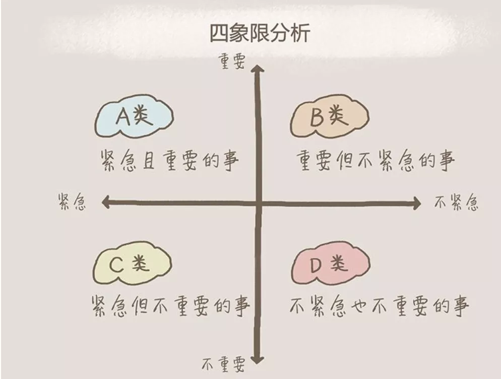

## 数据分析介绍
>简介： 什么是数据分析？需要掌握哪些技能？如何进行数据分析？本文全面梳理了数据分析知识体系，从数据分析的定义讲起，详细介绍了分析思维模型和经典分析模型及指标体系。

### 一 数据分析定义
数据分析是指有针对性的收集、加工、整理数据，并采用统计、挖掘技术分析和解释数据。数据分析是为了提取有用信息和形成结论而对数据加以详细研究和概括总结的过程。

#### 1 数据定义
数据是客观事实,对于客观事物发生，发展的数字化记录。随着科学技术的发展，数据的概念内涵越来越广泛包括数值，文本，声音，图像，视频。

数据可以分为定性数据和定量数据。

- 定性数据是用来描述事物的属性，名称等，它一种标志，没有序次关系。例如，“性别”，“男”编码为1，“女”编码为2。
- 定量数据描述量化属性，或用于编码。如交易金额、额度、商品数量、积分数、客户评分等都属于量化属性。

定量数据可以继续划分：定序数据、定距数据与定比数据。

- 定序数据（Ordinal）:数据的中间级，用数字表示个体在某个有序状态中所处的位置，不能做四则运算。例如，“受教育程度”，文盲半文盲=1，小学=2，初中=3，高中=4，大学=5，硕士研究生=6，博士及其以上=7。
- 定距数据（Interval）:具有间距特征的变量，有单位，没有绝对零点，可以做加减运算，不能做乘除运算。例如，温度。
- 定比变量（Ratio）:数据的最高级，既有测量单位，也有绝对零点，例如职工人数，身高。

#### 2 数据分析大事记
##### 计算机时代崛起

计算机的发展和计算技术的发展极大地增强了数据分析的过程。1880年，在使用计算机之前，美国人口普查局花了7年的时间来处理收集到的信息并完成最终报告。使用此设备，在18个月内完成了1890年的人口普查。

##### 关系数据库诞生

关系数据库由埃德加·科德（Edgar F. Codd）在1970年代发明，并在1980年代非常流行。关系数据库（RDBM）允许用户编写Sequel（SQL）并从其数据库中检索数据。关系数据库和SQL提供了能够按需分析数据的优势，并且仍在广泛使用。它们易于使用，对于维护准确的记录非常有用。

##### 数据仓库诞生

在1980年代后期，收集数据的数量继续显着增长，部分原因是硬盘驱动器的成本较低。在此期间，开发了数据仓库的体系结构，以帮助将来自操作系统的数据转换为决策支持系统。数据仓库通常是云的一部分，或者是组织的大型机服务器的一部分。与关系数据库不同，数据仓库通常经过优化，可快速响应查询。

##### 商业智能(BI)崛起

20世纪80年代-90年代，数十家BI厂商进入市场。数据仓库技术的发展大大推动了商业智能的发展，传统存储在各个地方的业务数据开始集中在一起。应运而生的技术还包括ETL（数据抽取、转换、加载）和OLAP（联机分析处理）。

##### 数据挖掘崛起

数据挖掘始于1990年代，是在当时多个学科发展的基础上发展起来的。随着数据库技术的发展应用，数据的积累不断膨胀，导致简单的查询和统计已经无法满足企业的商业需求，急需一些革命性的技术去挖掘数据背后的信息。

##### 大数据来临

2000年到2010年是大数据兴起和备受关注的时期，谷歌的“三驾马车”：谷歌文件系统、MapReduce和 BigTable。亚马逊也发表了一篇关于 Dynamo系统的论文。这几篇论文奠定了大数据时代的基础。随着大数据的到来，海量的数据以及新的技术发展，帮助公司将数据转化为洞察力。

##### 数据科学家

2012年9月， Tom Davenport和DJ Patil 在《哈佛商业评论》上发表了“数据科学家：21世纪最性感的工作” 。

##### 增强分析

2017年，Rita Sallman，Cindi Howson和Carlie Idonies在Gartner的研究论文中引入了增强分析的概念，并将其描述为一种新的数据分析方法，可使用机器学习和自然语言生成（NLG）自动化见解。增强型数据分析大大提升了数据分析效率，降低数据分析的门槛，人人都可以像数据科学家一样，对数据进行多维度的自动钻取，自动加载各种模型进行深度分析。

#### 3 数据分析 VS 数据科学 VS 商业智能
##### 商业智能（Business intelligence ）

泛指用于业务分析的技术和工具，通过获取、处理原始数据，将其转化为有价值的信息指导商业行动。维基百科定义为一个组织将所有资源转化为认知的能力。

##### 数据科学（data science）

是一个多学科领域，专注于从大量原始和结构化数据中找到切实可行的见解。该领域主要注重发掘我们没有意识到我们还不清楚的事情的答案。它结合了诸多领域中的理论和技术，包括应用数学、统计、模式识别、机器学习、数据可视化、数据仓库以及高性能计算。数据科学通过运用各种相关的数据来帮助非专业人士理解问题。

##### 三者关系

数据分析是一个相当广的领域，其中包含了数据科学。数据科学是最近比较火的一个名词，与传统的数据分析相比都是从数据中找到知识和见解，只是在使用的技能和方式下有一定差异。
并不是所有的数据分析都是商业的，所以他们两有一个定的交集。
有的数据科学过程并不直接是商业分析，但却是数据分析。比如在石油行业中“钻井作业优化”需要数据科学工具和技术，属于数据科学家的日常工作。但是，我们不能将其和商业分析关联起来。

#### 4 数据分析师 vs 数据科学家
虽然数据分析师和数据科学家都与数据打交道，但主要的区别在于他们如何处理数据。数据分析师检查大型数据集，以确定趋势、开发图表和创建可视化表示，以帮助企业做出更多的战略决策。另一方面，数据科学家使用原型、算法、预测模型和自定义分析设计和构建新的数据建模和生产流程。

数据科学家、数据工程师和软件工程师技能图谱：

### 二 为什么要分析
分析的本质是让业务更加清晰，让决策更加高效。在市场经济的条件下，企业面对激烈的竞争，差异化的市场，多变的环境，常常会面临各种难题。数据分析是用来解决企业的难题，识别机会，规避风险，问题诊断。

总结下来，数据分析可以帮助我们：

- 发生了什么：追溯过去，了解真相。
- 为什么发生：洞察事务发生的本质，寻找根源。
- 未来可能发生什么：掌握事务发展的规律，预测未来。
- 我们该怎么做：基于你已经知道的“发生了什么”、“为什么会发生”以及“未来可能发生什么”的分析，帮助你确定可以采取的措施，也就是：驱动行动。

### 三 如何分析？
分析的6个步骤：

#### 1 明确分析目的
##### 业务理解

从事数据分析工作的前提就是懂业务，即熟悉行业知识、公司业务及流程，有自己的业务见解。如果脱离行业认知和公司业务背景，分析的结果没有太大的使用价值。

如何做到懂业务？首先我们要明白我们业务的商业模式是怎么样的？即我们通过什么样的方式发生关系并最终产生什么样的商业价值。其次我们要了解我们商业模式的核心组成要素，例如我们的客户细分、收入来源、关键业务、核心的资源、成本的结构等等。除此之外我们要对核心的环境因素有所了解，例如宏观经济、市场影响、行业趋势等等。

##### 明确目的

数据分析第一步，不是分析数据而是把业务的问题或者目标定义清晰。通过这次数据分析想要解决一个什么样的问题，达成一个业务目标是什么？

#### 2 确定分析思路和框架
在明确分析的目的之后，我们需要梳理分析思路，并确定分析框架，即从哪些角度进行分析，采用哪些分析指标。在梳理分析思路的时候，将常见的思维模型应用与分析，能够帮我们更加清晰的理解背后的逻辑线索，做到”不重不漏“（MECE）。常见的思维模型有：结构化思维模型、时间模型、逻辑演绎模型、重要性思维模型。

当然在今天，除了思维模型，其实我们已经沉淀了很多经典的分析模型，这些分析模型历经随便的沉淀和检验。如果你熟悉这些分析框架你的思考会更加快速，有效。你不需要在另起炉灶，就能达到事半功倍。例如：SWOT分析模型、STP分析模型、RATER指数模型。

##### 掌握分析思维模型

思维模型就是我们对客观世界的一种主观抽象描述，通过思维模型来分析问题，从而更为准确地找到解决问题的方法。查理·芒格说过：“思维模型是你大脑中做决策的工具箱。你的工具箱越多，你就越能做出最正确的决策。”

###### 1）结构化模型

以事物的结构为思考对象，来引导思维、表达和解决问题的一种思考方法。例如麦肯锡的金字塔原理，5W2H七要素分析法。

**a）5W2H分析法** 

又叫七问分析法，是二战中美国陆军兵器修理部首创。简单、方便，易于理解、使用，富有启发意义，广泛用于企业管理和技术活动，对于决策和执行性的活动措施也非常有帮助，也有助于弥补考虑问题的疏漏。

**b）结构化思维**

是指一个人在面对工作任务或者难题时能从多个侧面进行思考，深刻分析导致 问题出现的原因，系统制定行动方案，并采取恰当的手段使工作得以高效率开展，取得高绩效。

**c）MECE原则**

MECE，是Mutually Exclusive Collectively Exhaustive，中文意思是“相互独立，完全穷尽”。也就是对于一个重大的议题，能够做到不重叠、不遗漏的分类，而且能够借此有效把握问题的核心，并解决问题的方法。

###### 2）时间模型

按照事物发展的时间线索，来进行分析。例如用户行为5阶段模型：需求的产生->信息收集->方案比较->购买决策->购买行为。

###### 3）逻辑演绎模型

演绎模型分为：

三段标准式演绎形式：大前提，小前提，结论。
常见4W模式：描述现象、分析原因、判断趋势、提出对策。
**a）麦肯锡七步分析法**

麦肯锡七步分析法又称“七步分析法”是麦肯锡公司根据他们做过的大量案例，总结出的一套对商业机遇的分析方法。它是一种在实际运用中，对新创公司及成熟公司都很重要的思维、工作方法。

**b）逻辑树分析法**

逻辑树是将问题的所有子问题分层罗列，从最高层开始，并逐步向下扩展。

###### 4）重要性思维

企业资源是有限的，需要把资源用在刀刃上。消费者的关注点有优先级，做好消费者关注的才能打动消费者。例如，四象限分析法提倡人们应有重点地把主要的精力和时间集中地放在处理那些重要但不紧急的工作上，这样可以做到未雨绸缪，防患于未然。

###### 5）经典思维模型

- 德尔菲法：一种高效重要的判断预测工具
- 六顶思考帽：有效实用的决策与沟通工具
- KT决策法：最负盛名的决策模型
- 头脑风暴法：激发团队创新的有效决策工具
- 垃圾桶模型：一种企业内部的决策制定模式
- 5W2H分析法：一种调查研究和思考问题的有效办法
- 决策树分析法：现代管理决策者常用的有效工具
- 综摄法：开发潜在创造力的一种创新方法
- 戈登法：适用自由联想的技术创新技法
- 奥斯本检核表法：创造技法之母，最著名、最典型的检核提问型创新法
- 黄金思维圈法则
- STAR原则

#####  掌握经典分析模型

分析模型是对客观事物或现象的一种描述。为了分析其相互作用机制，揭示内部规律，可根据理论推导，或对观测数据的分析，或依据实践经验，设计一种模型来代表所研究的对象。经典的分析模型一般都是以营销、管理等为理论基础的。

###### 1）战略与组织

- SWOT分析：战略规划的经典分析工具
- PEST分析：组织外部宏观环境分析工具
- BCG矩阵法：制定公司层战略最流行的工具
- GE矩阵：企业決定发展战略的分析工具
- 定向政策矩阵：战略业务组合计划分析工具
- IE矩阵：标识企业分布地位的分析工具
- 竞争态势矩阵：企业战略制定提供竞争优势的分析工具
- 麦肯锡三层面分析：企业设计战略规划、开拓增长的有效工具
- 波特五力分析：行业竞争战略最流行的分析工具
- 战略集团分析法：行业内企业竞争格局分析工具
- 战略钟模型：企业竞争战略选择分析工具
- 核心竞争力分析：分析企业有效竞争和成长的重要工具
- 波特价值链分析模型：寻求确定企业竞争优势的分析工具
- 利益相关者分析：战略制定和战略评价分析工具
- PIMS分析法：有效的战略评价分析工具
- SPACE矩阵：企业外部环境及战略组合分析工具
- QSPM矩阵：战略决策阶段重要分析工具
- 三四规则矩阵：成熟市场中企业竞争地位分析工具
- 7S模型：组织绩效与战略适应的分析工具20.3C战略三角模型：经典的营销战略管理工具
###### 2）营销服务

- STP分析：现代营销战略的核心分析工具
- 4Ps营销组合模型：制定市场战略最经典的营销理论工具
- 产品生命周期模型：描述产品和市场运作方法的有力工具
- 安索夫矩阵：应用最广泛的营销分析工具之一
- 服务质量差距模型：服务质量简单有效的分析工具
- 推销方格理论：直观有效的销售分析工具
- 哈夫模型：最有效的计算商圈的分析工具之一
- 服务金三角：服务组织管理的基石
- CS战略：企业提高市场占有率的有力工具
- SPIN销售法：系统化挖掘客户需求的销售工具
- 营销战略新三角模型：战略业务架构分析工具
- 服务利润链：服务管理最经典、最有效的分析工具
- 满意镜：提高顾客满意与员工满意的工具
- 顾客金字塔模型：有效的顾客细分管理工具
- 植田T理论：典型的竞争性理论策略工具
###### 3）人力资源

- 平衡计分卡：最具影响力的战略绩效管理工具
- 360度绩效考核：推进员工行为改变最有效的工具之一
- KPI：国际通行的企业经营绩效成果测量和战略目标管理的工具
- 3P模型：实施企业人力资源战略化管理的有效工具
- 职位分析问卷法：最普遍和流行的人员导向职务分析系统
- 关键事件技术：识别工作绩效的关键性因素的工作分析方法
- 贝尔宾团队角色理论：目前最权威、应用最广的团队理论
- 盖洛普Q12测评法：最经典的员工敬业度测评工具
- 绩效棱柱模型：新颖的绩效测量和管理分析工具
- Lifo管理系统：美国应用最广、发展最早的行为风格行为系统之一
- 宽带薪酬设计：一种新的薪酬管理系统及操作流程
- 霍兰德职业兴趣理论：通用的职业兴趣测验工具
- 胜任素质模型：人力资源战略和组织整体战略紧密结合的重要工具
- 职业锚：职业测评运用最广泛、最有效的工具之一
- 海氏工作评价系统：目前国际上最为流行、使用最为广泛的岗位评估工具
###### 4）质量及生产管理

- TPM：生产改善过程中的重要工具之一
- TQM：一项持续变革的有效管理体系
- 定置管理：强化现场管理和谋求系统改善的科学管理方法
- 5S现场管理法：现场科学管理的基础工具
- 六西格玛：世界最先进的质量管理法
- JIT生产方式：使生产有效进行的新型生产方式
- QFD法：一种顾客驱动的先进质量管理应用技术
- 田口方法：质量管理利器、企业技术创新不可或缺的工具
- 甘特图：最常用的项目控制管理的有效工具
- OPT：改善生产管理技术的新方式
- PDCA：循环有效控制管理过程和工作质量的工具
- AUDIT法：保证产品质量的先进质量管理控制方法
- 大规模定制：21世纪最重要的、最具竞争优势的生产模式
- 朱兰三步曲：质量战略思想和管理的有力武器
- 零缺陷管理法：企业质量管理方法的又一次革命
- QC七大手法：一组对质量管理活动的数据进行客观分析的有力工具
- 丰田生产方式：一套系统完整的生产管理方式
###### 5）财务管理工具

- 阿特曼Z-score模型：最著名的预测企业破产的方法
- ABC成本法：企业控制成本的有力工具
- 杜邦分析法：企业业绩评价体系中最为有效的工具之一
- 比率分析法：财务分析最基本的工具
- 经济附加值：当今最热门的财务创意
- 财务分析雷达图：企业经济效益综合分析工具
- 零基预算法：对企业的预算决策进行控制的有效工具
- 净现值法：企业投资决策中最基本、最常用的一种方法
- 沃尔评分法：对企业财务信用能力综合评价的方法
- 本量利分析：实施目标成本管理的一个重要工具
###### 6）项目与物流

- SCOR模型：第一个标准的供应链流程参考模型，供应链一体化的得力工具
- ECR系统：一种新型的供应链管理策略
- 快速反应策略：企业实现供应链竞争优势的有效管理工具
- 绿色供应链管理：可持续发展的供应链管理模式
- 责任矩阵：项目计划十分重要的工具
- 关键路径法：项目管理中应用最为广泛的方法之一
- 逻辑框架法：项目质量评价的综合评价方法
- PERT网络分析法：有效的项目进度管理工具
- VMI模型：国际前沿的供应链库存管理模式
- 工作分解结构：项目管理众多工具中最有价值的工具之一
###### 7）常见的分析模型

**a）SWOT分析模型**

用来确定企业自身的竞争优势、竞争劣势、机会和威胁，从而将公司的战略与公司内部资源、外部环境 有机地结合起来的一种科学的分析方法。

**b）STP分析**

客户细分（Segmentation）、目标客户选择(Targeting)、目标客户定位(Positioning)。

**c）经典的客户满意度模型**

RATER指数模型、KANO模型。例如：RATER指数是全美最权威的客户服务研究机构美国论坛公司投入数百名调查研究人员用近十年的时间对全美零售业、信用卡、银行、制造、保险、服务维修等十四个行业的近万名客户服务人员和这些行业的客户进行了细致深入的调查研究，发现一个可以有效衡量客户服务质量的RATER指数。

**d）PEST分析模型**

是指宏观环境的分析模型，宏观环境又称一般环境，是指一切影响行业和企业的宏观因素。对宏观环境因素作分析，不同行业和企业根据自身特点和经营需要，分析的具体内容会有差异，但一般都应对政治(Political)、经济(Economic)、社会(Social)和技术(Technological)这四大类影响企业的主要外部环境因素进行分析。简单而言，称之为PEST分析法。

**e）波特五力分析模型**

是迈克尔·波特(Michael Porter)于80年代初提出，对企业战略制定产生全球性的深远影响。用于竞争战略的分析，可以有效的分析客户的竞争环境。五力分别是：供应商的议价能力、购买者的议价能力、潜在竞争者进入的能力、替代品的替代能力、行业内竞争者现在的竞争能力。五种力量的不同组合变化 最终影响行业利润潜力变化。

**f）经典营销管理模型4P、4C、4S、4R、4V、4I**

以满足市场需求为目标的4P理论，以追求顾客满意为目标的4C理论，以建立顾客忠诚为目标的4R理论等。

**g）用户行为理论**

**h）AARRR模型**

AARRR是Acquisition、Activation、Retention、Revenue、Refer这五个单词的缩写，分别对应用户生命周期中的5个重要环节：获取用户、提高用户活跃度、提高用户留存率、获取收入、自传播。AARRR模型因其掠夺式的增长方式也被称为海盗模型，同时它也是一个典型的漏斗模型可以用来评估连续的业务流程节点转化率。通过该模型可以有针对性的对出现问题的重要节点进行优化，达到提升ROI的目的。

#### 指标体系设计

指标体系的设计是一个业务数据化的过程。好的指标设计能够抽象目标具体化，具有直接实践意义。

##### 1）什么是指标

通常我们讲述的指标是指将业务单元精分后量化的度量值，譬如：DAU、订单数、金额等。当然，原子指标还会基于维度、修饰词、统计口径而构建出派生指标。指标的核心意义是它使得业务目标可描述、可度量、可拆解。

##### 2）什么是好指标

好的数据指标是比较性的，可以是一个比率。因为比率的可操作性强、天生比较性指标、适用于比较各种因素间的相生和相克。例如：“本周转化率比上周高0.5个百分点”显然比“转化率为2%”更有意义。会计和金融分析师仅需迅速查看几个比率就能对一个公司的基本状况做出判断。例如：市盈率、毛利率、利润率，等等。

好的数据指标是简单易懂的。如果人们不能容易记住或讨论某个指标，那么通过改变它来改变公司的作为将会十分困难。

好的数据指标可以衡量当前业务的真实情况。

好的数据指标会改变行为。这是最重要的评判标准。

##### 3）什么是指标体系

将数据指标系统性的组织起来，可以按照业务模型。指标体系会对按照指标不同的属性分类及分层。

指标不成体系会怎样？

- 从业务视角看：经常碰到的一种现象是业务上线了之后发现数据不够用，缺指标或缺维度。
- 从技术视角看：基于需求的变更，业务团队技术同学将需要重新去更改设计和开发埋点，数据团队技术则需要重新采集、清洗、存储数据。
##### 4）常见指标体系构建过程

#### 指标设计规范

随着数据量的增大，数据指标也会越来越多，即使是同样的命名，但定义口径却不一致。这对于各部门理解难度大，同时也造成了重复计算存储的资源浪费。阿里OneData指标规范，以维度建模作为理论基础，构建总线矩阵，定义业务域、数据域、业务过程、度量/原子指标、维度、维度属性、修饰词、修饰类型、时间周期、派生指标等，帮助我们形成统一数据标准。

#### 第一关键指标原则

第一关键指标（OMTM：One Metric That Matters）原则就是在当前阶段高于一切，你需要集中全部注意力的数字。

使用第一关键指标的理由：

- 它回答了现阶段最重要的问题。
- 它促使你建立清晰的目标。
- 它关注的是整个公司层面的健康。
- 它可以提高行动力。
- 选择第一关键指标的同时它还会解释下一个关注点。

#### 常见指标名词

你所在商业领域决定了你应关注的指标。常见商业模式分类有电商类、内容类、社区类、软件工具类、游戏类。

##### 1）电商类

电商类的指标常见分类：

常见的指标定义如下：

- PV（page view）：即页面浏览量，用户每1次对网站中的每个网页访问均被记录1次。用户对同一页面的多次访问，访问量累计。在一定统计周期内用户每次刷新网页一次也被计算一次。
- UV（unique visitor）：即独立访客，访问网站的一台电脑客户端为一个访客。
- DAU（Daily Active Users）日活跃用户：每日登陆过的用户数。
- WAU（Weekly Active Users）周活跃用户：七天内登陆过的用户数。
- MAU（Monthly Active Users）月活跃用户：30天内登陆过的用户数。
- 收藏人数：统计日期内，通过该渠道访问该商品并收藏该商品的去重买家人数。
- 收藏次数：统计时间内，宝贝被来访者收藏的次数，一件宝贝被同一个人收藏多次记为多次。
- 加购人数：统计时间内，访客将商品加入购物车的访客去重数。
- 加购次数：选定周期下，该行业下商品物品被加入购物车的次数。
- 支付金额：买家拍下后支付给的金额，未剔除售中售后退款金额，预售阶段付款在付清尾款当天才计入内，货到付款订单确认收货时计入内。
- 支付子订单数：也被称为支付笔数，比如某个买家在某个店铺购买了多个宝贝一起下单支付，订单后台会展现每个产品每个SKU粒度下会有一条记录，这个就是一个子订单。
- 支付转化率：统计时间内，支付买家数/访客数，即来访客户转化为支付买家的比例。
- 店内搜索次数：在所选的终端（PC或无线）上，在店铺内搜索关键词的次数，一个关键词被同一个人搜索多次，记为多次。关键词的一次搜索后多次翻页查看搜索结果，搜索次数记为一次。
#### 2）游戏类

游戏类产品考虑的指标很多，根据最想要知道的指标大致可以分为四大类：用户、付费、推广和游戏。

- 用户类：平均同时在线人数（ACU）、最高同时在线人数（PCU）活跃用户数（包括日/周/月活跃）、留存率（次日/三日/七日/月）、活跃用户、每日新增用户数、每日流失人数。
- 付费类：活跃付费账户（APA）、付费率（PUP）、每位用户平均收入 ARPU（Average Revenue Per User）
- 游戏类：游戏道具消费排行、比例，平均在线时间（人均、最高、最低），游戏用户等级分布，游戏用户持有虚拟货币量（人均、最高、最低）
- 推广类：下载量（日、周、月），注册用户量、激活率（日、周）。

> 参考资料

https://data-flair.training/blogs/data-scientist-vs-data-analyst/
https://www.datapine.com/blog/data-science-vs-data-analytics/
https://www.leiphone.com/news/201703/u6UW2CFBbGa4bRrN.html
http://www.woshipm.com/pmd/1418055.html
https://radacad.com/do-you-need-a-date-dimension
https://www.zhihu.com/question/20117449
https://zhuanlan.zhihu.com/p/43529971
https://www.cnblogs.com/fanyu2019/p/11502913.html